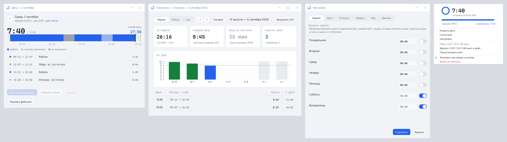

# GoHome

Трей-утилита для Windows: считает, сколько сегодня отработано. Короткие отлучки и встречи идут
в рабочее время, из него вычитается только обед — и тот определяется сам, по времени и
длительности. На восьми часах приходит уведомление — ровно один раз за день. Ничего нажимать
не нужно: приложение висит в трее кольцом прогресса и вопросов не задаёт.



Те же окна в тёмной теме — [docs/windows-dark.png](docs/windows-dark.png).

---

## Установка

1. Скачайте `GoHome-<версия>-win-x64.zip` из [релизов](../../releases).
2. **Разблокируйте архив до распаковки** — см. ниже.
3. Распакуйте куда угодно и запустите `install.cmd`.

Скрипт скопирует программу в `%LOCALAPPDATA%\Programs\GoHome`, зарегистрирует автозапуск
при входе в систему и сразу её запустит. Права администратора не нужны.

### Два места, где обычно застревают

**«Windows защитила ваш компьютер».** Бинарник не подписан сертификатом — подпись стоит денег,
а утилита самодельная. SmartScreen показывает синее окно без видимой кнопки «запустить». Нужно
нажать **«Подробнее»**, и под текстом появится кнопка **«Выполнить в любом случае»**.

**Архив помечен как скачанный из интернета.** Windows ставит на скачанные файлы метку
(mark of the web), и распакованные из такого архива файлы могут молча не запускаться. Поэтому
до распаковки: правой кнопкой по `.zip` → **Свойства** → внизу вкладки «Общие» галочка
**«Разблокировать»** → ОК. Если архив уже распакован, снимите метку тем же способом
с `GoHome.exe` и с `install.cmd`.

Контрольные суммы файлов релиза лежат рядом в `SHA256SUMS.txt` — единственный способ убедиться,
что скачалось именно то, что собралось:

```powershell
Get-FileHash .\GoHome-0.1.0-win-x64.zip -Algorithm SHA256
```

Антивирус к неподписанной самодельной программе тоже может отнестись настороженно. Проверить,
что именно вы скачали, можно суммой выше или через [virustotal.com](https://www.virustotal.com).
Само приложение в интернет не выходит: обновление — отдельный скрипт, который запускаете вы.

---

## Как именно считается время

Это единственное, чего нельзя угадать, поэтому подробно.

**Из рабочего времени вычитается только обед.** Чай, туалет, переговорка, разговор в коридоре,
десять минут на телефоне — всё это рабочее время и счётчик не останавливает. Считается рабочий
день, а не время, проведённое строго перед экраном.

Это поведение по умолчанию, и его можно поменять одной галочкой — см. [Модель
учёта](#модель-учёта). Всё, что написано ниже про обед, относится к включённой галочке.

**Обед определяется сам, по времени и длительности.** Обедом становится отлучка, которая
началась между 11:30 и 15:00 и продлилась дольше 25 минут. Всё, что короче или вне этого окна,
уходит в зачёт молча — вопросов вам никто не задаёт.

**Обед бывает не больше одного раза в день.** Как только он определён, все остальные длинные
отлучки идут в зачёт автоматически. Поэтому неоднозначный случай за день остаётся ровно один.

**Догадку можно отменить в один клик.** Когда вы возвращаетесь с обеда, приложение показывает
подсказку: такой-то перерыв засчитан обедом. Если это был не обед, а полуторачасовая встреча,
щёлкните по подсказке — время вернётся в зачёт. Тот же пункт лежит в меню трея и доступен
до конца дня, а не только пока висит подсказка. Если догадка верна — а она верна почти всегда, —
делать не нужно ничего.

Отмена не просто снимает пометку: следующая подходящая отлучка снова становится кандидатом.
Встреча в 11:45 не съедает попытку, и настоящий обед в 13:00 будет распознан.

**Любой перерыв можно переклассифицировать вручную.** В окне истории выберите день — внизу
появится список его перерывов. Выберите перерыв и нажмите кнопку под списком: она переносит
его из зачёта и обратно. Так помечается поликлиника или, наоборот, возвращается в зачёт
неверно угаданный обед. Ручная пометка ограничением «один раз в день» не связана: бывает
и обед, и поликлиника.

**Последняя блокировка за день — это уход домой.** Приложение не различает «отошёл» и «ушёл»
в момент нажатия `Win+L`. Но если до конца рабочего дня разблокировки не последовало, эта
блокировка задним числом становится уходом, и вечер не превращается в бесконечный перерыв.
Обедом она при этом не становится никогда, даже если пришлась ровно на обеденное окно:
догадка срабатывает на возвращении, а тут никто не вернулся.

**Пока вы не вернулись, отлучка в зачёт не идёт.** Счётчик во время перерыва стоит, а
недостающие минуты добавляются в момент возвращения — когда уже понятно, обед это был или нет.
Так счётчик никогда не приходится уменьшать задним числом.

**Рабочий день сдвинут и начинается в 04:00.** Работа до часу ночи относится к предыдущей дате.
Иначе вечерняя переработка разъехалась бы на два дня и оба выглядели бы неполными. Норма
берётся по этой же, сдвинутой дате: работа с пятницы 22:00 до субботы 01:00 — это пятница
со своей нормой, а не суббота.

**Норма дня берётся из недельного графика.** По умолчанию восемь часов с понедельника
по пятницу, суббота и воскресенье — нерабочие. Отдельные даты можно задать исключением —
см. [Настройки](#настройки).

**В нерабочий день время считается как обычно, но нормы нет.** Уведомление «можно домой»
не приходит, кольцо в трее не заполняется, а всё отработанное идёт в недельный баланс
со знаком плюс. Нерабочий день — не то же самое, что норма в ноль часов: нулевая норма
формально достигнута в момент запуска, и уведомление пришло бы сразу.

**Приход не фиксируется, пока экран не разблокирует живой человек.** Ни запуск приложения,
ни вход в систему приходом не считаются. Так корпоративная Windows, которая ночью сама логинится
в вашу сессию ради обновлений (ARSO), не портит статистику: она умеет войти в сессию,
но не умеет ввести пароль.

**Автоблокировку по политике счётчик не оплачивает.** Если сессия гаснет сама через N минут
простоя, эти N минут вычитаются: пауза ставится тем моментом, когда вы в последний раз коснулись
клавиатуры, а не когда погас экран.

**Если машина умерла с открытым интервалом** — ребут по обновлению, севшая батарея, синий экран —
день закрывается по времени последней активности пользователя. Не по времени перезагрузки:
иначе ночной ребут записал бы уход в 03:00.

### Модель учёта

Галочка **«засчитывать короткие отлучки»** в настройках переключает две модели.

| | Включена (по умолчанию) | Выключена |
|---|---|---|
| Короткая отлучка | идёт в рабочее время | вычитается |
| Длинная отлучка | идёт, если не определена обедом | вычитается |
| Обед | определяется догадкой, вычитается | понятия нет, вычитается всё |

Выключенная галочка означает буквально «счёт останавливает любая блокировка экрана,
независимо от длительности». Настройки обеда при этом не влияют ни на что, и в форме
они становятся недоступны — режется всё.

### Дни, накопленные до смены правил

Раньше счётчик останавливала любая блокировка экрана — то же самое, что выключенная
галочка сейчас. Накопленные по тем правилам дни не пересчитываются: у каждого дня в файле
записан снимок правил и нормы, по которым он считался, и ставится он один раз, при создании
дня. Если настройки поменяются в середине дня, сегодняшний день целиком досчитается
по-старому — иначе его половины оказались бы посчитаны по-разному.

Файлы, созданные до появления снимка, читаются как прежде: и те, у которых поля правил
не было вовсе, и те, где стоит старое поле `rulesVersion`.

В окне истории у каждого дня есть колонка «Отлучки» со значением `в зачёт` или `режутся`.
Если в неделю попали и те и другие, под таблицей появляется поясняющая строка: цифры
за такие дни несопоставимы напрямую, и это не ошибка.

### Недельный баланс

Под таблицей истории видно, сколько отработано за календарную неделю с понедельника,
какова норма недели и накопленная разница.

**Норма недели — сумма норм её дней.** У прожитых дней берётся норма, сохранённая в их
файлах, у будущих — нынешние настройки. Поэтому изменение графика в среду не переписывает
понедельник. Разница считается по уже прожитым дням: иначе в понедельник утром она всегда
показывала бы «минус целая неделя».

**Баланс только показывается.** Он не уменьшает и не увеличивает норму отдельных дней:
иначе кольцо начинало бы прыгать, а уведомление приходить в непредсказуемый момент.
Между неделями баланс не переносится — это уже учёт, а не трекер.

### Почему счётчик не растёт

По убыванию частоты:

| Что видно | Что происходит |
|---|---|
| Кольцо серое, в подсказке «пауза» | Экран блокировали и ещё не разблокировали, либо нажата ручная пауза. Минуты не потеряны: они добавятся в момент возвращения. |
| Кольцо серое, в подсказке «день закрыт» | Последняя блокировка была засчитана как уход. Меню → «Продолжить» вернёт счёт. |
| В подсказке «день не начат» | Сегодня ещё не было ни одной разблокировки экрана — приход не зафиксирован. Нажмите `Win+L` и разблокируйте, либо выберите в меню «Продолжить». |
| Счётчик отыграл назад | Перерыв только что засчитан обедом — в подсказке видно, на сколько. Если это был не обед, отмените догадку через меню трея. |
| В подсказке «(обед 45 мин)» | Столько времени вычтено из рабочего. Какой именно перерыв — видно в меню и в истории. |
| Кольцо зелёное | Восемь часов уже отработаны, кольцо заполнено целиком. Время продолжает идти, просто кольцо расти больше некуда. |
| Цифры не сходятся с ощущениями | Откройте день: там виден каждый отрезок поимённо, и время в нём правится прямо в окне. |
| Подсказка «не удаётся сохранить файл дня» | Файл кем-то занят — обычно антивирусом или открытым в редакторе журналом. Счёт не останавливается, накопленное запишется само, как только файл освободится. Подробности — в `%APPDATA%\GoHome\errors.log`. |
| Подсказка «файл дня не разбирается» | После ручной правки в JSON осталась опечатка. Приложение файл не трогает, чтобы вы могли починить его сами; до этого день показан пустым. |

---

## Меню в трее

Сверху меню — сводка дня: кольцо, счётчик, полоса до цели, приход и прогноз ухода. Она
отвечает на вопрос «сколько ещё» без открытия окна и платит за это высотой меню.

| Пункт | Что делает |
|---|---|
| `Открыть день` | Окно дня: полоса времени, отрезки списком, цифры дня. Открывается и левым щелчком по значку. |
| `Статистика` | Графики и дни за неделю, месяц или год. |
| `Настройки` | Рабочая неделя, исключения, отлучки, уведомления, внешний вид, данные. |
| `Обед: 12:40–13:25 (45 мин)` | Что именно вычтено из рабочего времени. Появляется, только когда есть что вычитать. |
| `Вернуть 12:40–13:25 в зачёт` | Отмена автоматической догадки. Живёт до конца дня. |
| `Приостановить учёт` / `Продолжить учёт` | Ручное управление, если автоматика ошиблась. |
| `Запускать при входе в систему` | Задача в планировщике. Не автозагрузка через реестр: неподписанный exe, прописывающий себя в `HKCU\...\Run`, — типовая сигнатура для корпоративного EDR. |
| `Выйти из GoHome` | Учёт останавливается совсем — единственный пункт, после которого он не идёт. |

Цвет кольца: синее — время идёт, серое — пауза, зелёное — норма отработана. В нерабочий
день кольцо не заполняется вовсе.

Переключатель автозапуска живёт только здесь, в меню, и в окне настроек его нет специально.
Это не поле, которое сохраняется по кнопке, а немедленное действие над задачей планировщика:
состояние читается из планировщика каждый раз заново, поэтому разъехаться ему негде.

---

## Окно дня

Один день целиком: полоса времени сверху, под ней те же отрезки списком, справа — цифры дня.
Открывается левым щелчком по значку в трее, пунктом меню и щелчком по дню в статистике.
Стрелки в шапке ходят по дням; дальше сегодняшнего не пускают — того дня ещё не было.

**Полоса** идёт от часа прихода до последнего события, но не уже четырёх часов: полчаса
работы, растянутые на всю ширину окна, читались бы как полный день. Работа рисуется акцентом,
засчитанная отлучка — им же, но приглушённым, обед и всё, что не пошло в зачёт, — серым.
Отдельная отметка показывает текущий момент, пунктир — когда наберётся норма.

Вечер, уходящий за полночь, — обычный непрерывный отрезок: [рабочие сутки](#модель-учёта)
сдвинуты, и календарная полночь внутри дня ничем не примечательна.

**Идущая прямо сейчас пауза** рисуется паузой, а не работой. В расчёт она пока не входит —
чем она окажется, станет ясно на возвращении, — но нарисовать её работой значило бы соврать.

### Правка дня

Выберите отрезок — под списком появятся действия:

| Действие | Что делает |
|---|---|
| `Засчитать как работу` / `Не засчитывать` | Меняет зачёт отлучки. Ложится отдельной поправкой, отметки журнала не трогает. |
| `Изменить время` | Двигает границы отлучки. Меняет сам журнал, и правленые отметки помечаются. |
| `Удалить` | Убирает отлучку: время до и после смыкается в работу. Спрашивает подтверждение. |

**Ручная правка сильнее автоматики.** Снятая пометка обеда не возвращается на следующем
пересчёте, даже если после этого подвинуть границы: поправка уезжает вместе с началом отлучки.

**Недопустимое значение не сохраняется и объясняет причину**: конец раньше начала, наезд
на соседнюю отлучку, выход за пределы рабочих суток, начало раньше прихода. Проверка идёт
на том же журнале и под тем же замком, что и запись, — служба дописывает в этот файл, пока
окно открыто, и проверить заранее значило бы проверить устаревшую копию.

`Ctrl+Z` отменяет последнее: смену зачёта, сдвиг границ и удаление. Отмена удаления
возвращает ровно те отметки, которые были убраны, — они держатся в памяти до закрытия окна.
Общей операции «добавить отлучку» нет намеренно: ею можно было бы нарисовать перерыв,
которого не было.

**Правка файла руками по-прежнему работает.** Окно замечает чужую запись и перечитывает день;
надёжнее всего это происходит при возвращении фокуса в окно.

Повреждённый файл не притворяется пустым днём: окно говорит о нём и ничего в нём не предлагает.

---

## Статистика

Период целиком: цифры сверху, график, под ним дни строками. Двойной щелчок по строке или
по столбцу открывает день. Открывается из меню трея.

### Графики

Неделя и месяц рисуются столбцами: столбец на день, поперёк — линия нормы. Столбцы, дотянувшие
до нормы, отличаются цветом от недотянувших, а нерабочие дни помечены отдельно: нормы у них
нет, и линия нормы к ним не относится. Если нормы дней разные — сокращённый предпраздничный
день, отпуск, — норма рисуется штрихом над каждым днём: одна линия поперёк в этом случае врала
бы, и полностью закрытый короткий день выглядел бы недоработанным.

Год рисуется календарной сеткой: недели столбцами, дни недели строками, насыщенность клетки —
доля от нормы. Двести пятьдесят столбцов не читаются ни на каком экране, а сетка на том же
месте читается сразу: отпуск и провал в декабре видны одним взглядом.

Наведите мышь на столбец или клетку — в подсказке будут дата, отработанное и норма.

Графики рисует само приложение теми же средствами, что и кольцо в трее: сторонних библиотек
в проекте нет и не будет. Цвета следуют теме окон из настроек, размеры — масштабу экрана.

### Числа над графиком

Четыре карточки: отработано за период с нормой к сегодняшнему дню и балансом, средняя
продолжительность дня с обычным временем прихода, средняя длительность обеда с обычным
временем ухода, число рабочих и нерабочих дней.

Норма к сегодняшнему дню и норма периода — разные числа: сравнивать отработанное с полной
нормой месяца первого числа бессмысленно, поэтому в карточке стоит первая.

Ниже — дни строками: дата, приход и уход, отработанное, отлучки и отклонение от цели.
Дни без единой отметки в список не попадают: строка из одних прочерков ничего не сообщает.

**Норма периода — сумма норм его дней**, а не число дней, умноженное на восемь часов: у каждого
дня своя норма, сохранённая в его файле. Нерабочие дни в норму не входят, но отработанное
в них идёт в баланс со знаком плюс.

Пустой период ничего не ломает: график рисуется, средних просто нет — придумывать их не из чего.

### Выгрузка в CSV

Кнопка «Выгрузить CSV» сохраняет период по дням: дата, день недели, приход, уход, отработанное,
норма, баланс, перерывы и то, что не пошло в зачёт. Разделитель — точка с запятой, дробная часть —
через запятую, кодировка — UTF-8 с BOM: так файл открывается в Excel с русскими региональными
настройками сразу, без мастера импорта и без правки руками. Длительности выгружаются дважды —
как `7:45` и как `7,75`: первое читать глазами, второе складывать формулой.

### Испорченные файлы и большие периоды

Нечитаемый файл дня статистику не роняет: такой день пропускается, а над графиком появляется
строка о том, сколько файлов не прочиталось. Числа за период тогда неполные — и это видно,
а не замалчивается.

Год — это около двухсот пятидесяти файлов. Читаются они один раз при открытии периода и в фоне,
поэтому окно не подвисает, а перерисовка графика к диску уже не обращается.

---

## Настройки

Открываются из меню трея. Всё, что в них есть, лежит в одном файле и правится либо формой,
либо руками — как и файлы дней.

```
%APPDATA%\GoHome\settings.json
```

Слева — разделы; в узком окне они сворачиваются в строку вкладок сверху.

### Раздел «Рабочая неделя»

Продолжительность рабочего дня отдельно для каждого дня недели и переключатель «нерабочий»
справа от него. Время набирается, а не крутится стрелками: «8:00» набрать быстрее.

### Раздел «Исключения»

Список дат, перекрывающих недельный график: отпуск, праздники, предпраздничные дни
сокращённой продолжительности. **Исключение сильнее недельного графика.**

Дата в окне исключения тоже набирается — `31.12.2026`. Календаря нет намеренно: поле выбора
даты Windows не перекрашивается под тему приложения вовсе, а долистать в нём до декабря
дольше, чем набрать восемь цифр.

Производственный календарь не загружается и загружаться не будет: приложение в сеть
не ходит вовсе, а полтора десятка дат в году вводятся руками за пару минут.

### Раздел «Отлучки и обед»

| Настройка | Что делает |
|---|---|
| `Засчитывать короткие отлучки` | Переключает [модель учёта](#модель-учёта). |
| `Обеденное окно, с` / `по` | В какие часы отлучка может оказаться обедом. |
| `Короче этого — не отлучка` | Совсем короткие интервалы не показываются в окне дня. |
| `Короче этого — не обед` | Догадка не срабатывает на отлучках короче этого. |

При выключенном зачёте коротких отлучек настройки обеда недоступны: они не влияют ни на что,
а активные поля, ничего не делающие, — это обещание, которого форма не держит.

### Раздел «Уведомления»

| Настройка | Что делает |
|---|---|
| `Предупреждать, что норма скоро` | Включает предупреждение. Снятая галочка — предупреждения нет. |
| `За сколько до нормы` | Насколько раньше сказать. По умолчанию 15 минут. |

Смысл предупреждения в том, чтобы успеть свернуть дела, а не узнать постфактум.

- приходит **один раз за день**: признак живёт в файле дня и переживает перезапуск;
- в нерабочий день не приходит — нормы у него нет;
- во время паузы не возникает: в паузе отработанное не растёт, и порог пересекается только
  тогда, когда человек за клавиатурой;
- если пересчёт перебросил счётчик сразу через оба порога — так бывает, когда снимаешь пометку
  обеда, — придёт только уведомление о норме: два уведомления подряд про одно и то же выглядят
  сломанными;
- поднятая норма снимает оба признака, и уведомления приходят заново, уже по новой норме.

Значение не может быть длиннее самого короткого рабочего дня в графике: иначе предупреждение
обгонит саму норму.

### Раздел «Внешний вид»

Тема окон: как в системе, светлая или тёмная. Применяется мгновенно и ко всем открытым окнам
целиком — заголовок окна приложение рисует само, и ждать переоткрытия больше не нужно.

**На кольцо в трее тема не влияет никогда** — кольцо живёт на панели задач и следует её
оформлению. Принудительно тёмное кольцо на светлой панели стало бы невидимым. Windows
оформляет панель задач и окна приложений двумя разными настройками, и приложение спрашивает
про них в разных местах.

В режиме высокой контрастности обе палитры не используются вовсе: цвета берутся системные.
Тему в этом режиме выбрал человек, и подбирать под неё свои оттенки бессмысленно.

### Раздел «Данные»

Путь к файлу настроек и к каталогу дней с кнопками «Показать в папке», и сброс настроек
к значениям по умолчанию. Файлы дней сброс не затрагивает.

### Что действует когда

**Правила расчёта действуют со следующего дня.** Это модель учёта и настройки обеда: они
определяют, как минуты превращаются в отработанное время. Смена обеденного окна в два часа
дня означала бы, что засчитанный утром обед перестал быть обедом, — и день оказался бы
посчитан двумя способами. Поэтому у каждого дня свой снимок правил, поставленный при его
создании.

**Норма дня подхватывается сразу**, включая сегодняшний день и любую дату, помеченную
исключением. Норма — не правило: она только сравнивается с итогом, и поправить её задним
числом безопасно.

**Оформление и предупреждение о скорой норме применяются немедленно**, без перезапуска
и без сохранения: ни то, ни другое не меняет подсчёта времени — они выбирают только то,
что видно и когда сказано.

### Проверка значений

Форма не даёт сохранить негодные настройки и объясняет, что именно не так. Недобранное
время — «9» вместо «9:00» — тоже негодное значение, и поле краснеет само. Проверяются
и связки, а не только отдельные поля: порог короткой отлучки больше минимальной длительности обеда
означает, что обед не определится никогда, и по одному полю этого не увидеть. Так же проверяется
предупреждение: само по себе осмысленно любое число минут, а больше самого короткого рабочего
дня — это предупреждение раньше, чем день начался.

В файле, правленом руками, негодное значение заменяется значением по умолчанию с записью
в `errors.log`, а остальные значения при этом принимаются. Если же файл не разбирается
целиком — оборванная скобка, «99:00:00» вместо длительности, — приложение работает
на значениях по умолчанию, показывает подсказку из трея и **файл не трогает**, чтобы вы
могли починить его руками. Отсутствие файла ошибкой не считается: он заводится при первом
сохранении.

### Файл настроек

```json
{
  "countShortBreaks": true,
  "lunch": {
    "windowStart": "11:30:00",
    "windowEnd": "15:00:00",
    "minimum": "00:10:00",
    "guessMinimum": "00:25:00"
  },
  "schedule": {
    "monday": "08:00:00",
    "tuesday": "08:00:00",
    "wednesday": "08:00:00",
    "thursday": "08:00:00",
    "friday": "08:00:00",
    "saturday": null,
    "sunday": null
  },
  "exceptions": [
    { "date": "2026-01-01", "hours": null, "note": "Новый год" },
    { "date": "2026-04-30", "hours": "07:00:00", "note": "предпраздничный" }
  ],
  "theme": "System",
  "warnBefore": "00:15:00"
}
```

`null` в продолжительности означает нерабочий день — и в графике, и в исключениях.
Длительности пишутся как `ч:мм:сс`; больше суток задаётся через `1.06:00:00`. `theme` —
`System`, `Light` или `Dark`. `warnBefore` — за сколько до нормы предупредить; `00:00:00`
означает, что предупреждения нет. Запятые в конце списка и комментарии `//` допускаются, как
и в файлах дней.

Кнопки внизу формы открывают этот файл и каталог данных в проводнике, а «Сбросить всё»
возвращает значения по умолчанию — файлы дней это не затрагивает.

---

## Обновление

Обновление запускаете вы. Приложение о релизах ничего не знает и в сеть не ходит вовсе —
ни при запуске, ни по расписанию. Это сознательное решение, а не недоделка: программа
живёт на рабочей машине, а профиль «читает файлы профиля → ходит в сеть → скачивает
исполняемый файл → подменяет себя → сидит в автозапуске» антивирус разбирать не станет.

```powershell
%LOCALAPPDATA%\Programs\GoHome\update.cmd
```

Скрипт лежит рядом с программой — его кладёт туда `install.cmd`. Он спрашивает GitHub про
последний релиз, скачивает бинарник, **сверяет контрольную сумму**, останавливает приложение,
дожидается завершения процесса, заменяет файл и запускает обратно. Сумма не сошлась —
скачанное удаляется, установленная версия остаётся нетронутой.

Путь установки не меняется, поэтому **задача планировщика продолжает работать** —
переустанавливать ничего не нужно. Накопленное за день время не теряется: отметки пишутся
сразу в файл дня, и остановка процесса на них не влияет.

**Текущая версия** — в первой строке вывода скрипта (`Установлена версия 0.0.2`).
Без запуска: правой кнопкой по `GoHome.exe` → **Свойства** → вкладка **Подробно**.

### Скрипт стареет вместе с версией

`update.cmd` и `update.ps1` ставятся один раз и себя не обновляют, так что у вас на диске
может лежать скрипт от прошлогодней версии. Работать он будет: он опирается только на то,
что релизы держат неизменным от версии к версии — имя ассета `GoHome-<версия>-win-x64.exe`,
файл `SHA256SUMS.txt` и путь установки. Сборка релиза это проверяет и падает, если что-то
из этого исчезло. Свежие скрипты всегда лежат в архиве очередного релиза.

Поставить релиз поверх той же версии — например, после неудачного обновления:

```powershell
powershell -ExecutionPolicy Bypass -File .\update.ps1 -Force
```

### Совсем вручную

Если скрипт не сработал — например, GitHub недоступен из корпоративной сети, — то же самое
делается руками: скачать `GoHome-<версия>-win-x64.exe` из [релизов](../../releases),
сверить сумму с `SHA256SUMS.txt`, закрыть приложение через `Выход` в меню трея, положить файл
в `%LOCALAPPDATA%\Programs\GoHome\GoHome.exe` вместо старого и запустить.

---

## Где лежат данные и как их править

```
%APPDATA%\GoHome\days\2026-08-06.json     файл рабочего дня
%APPDATA%\GoHome\settings.json            настройки
%APPDATA%\GoHome\errors.log               что и почему не удалось записать
```

Один файл на рабочий день, имя — рабочая дата (с учётом сдвига на 04:00). Формат человеческий,
и это не случайность: файл рассчитан на правку руками в блокноте.

```json
{
  "date": "2026-08-06",
  "lastHeartbeat": "2026-08-06T18:31:00+03:00",
  "lastUserActivity": "2026-08-06T18:30:12+03:00",
  "goalNotified": true,
  "warningNotified": true,
  "rules": {
    "goal": "08:00:00",
    "countShortBreaks": true,
    "lunch": {
      "windowStart": "11:30:00",
      "windowEnd": "15:00:00",
      "minimum": "00:10:00",
      "guessMinimum": "00:25:00"
    }
  },
  "adjustments": [
    { "breakAt": "2026-08-06T13:02:11+03:00", "kind": "Paid", "source": "cancelled" }
  ],
  "punches": [
    { "at": "2026-08-06T09:12:03+03:00", "kind": "BreakEnd", "source": "startup" },
    { "at": "2026-08-06T13:02:11+03:00", "kind": "BreakStart", "source": "SessionLock" },
    { "at": "2026-08-06T13:47:52+03:00", "kind": "BreakEnd", "source": "SessionUnlock" }
  ]
}
```

Отметки бывают четырёх видов: `In` — приход, `BreakStart` — уход на перерыв, `BreakEnd` — возврат,
`Out` — уход. Поле `source` ни на что не влияет, оно только для чтения глазами.

**Классификация перерывов — не вид отметки, а отдельный список `adjustments`.** Так сделано
потому, что в момент блокировки тип отлучки ещё неизвестен: журнал остаётся сырым, а поправки
применяются при чтении. Поправка привязана к началу интервала полем `breakAt` и бывает двух
видов: `Unpaid` — не идёт в рабочее время, `Paid` — идёт. Поправка сильнее и правил, и догадки.

Списка `adjustments` в файле нет, пока никто ничего не поправил. Если после ручной правки
поправка перестала указывать на существующий перерыв, она просто игнорируется — расчёт от этого
не ломается.

`rules` — снимок правил и нормы, по которым считается этот день. Ставится при создании дня
и дальше не меняется, кроме `goal`: норму текущего дня и помеченных дат приложение
подтягивает из настроек. Менять снимок руками у уже прожитого дня имеет смысл только
если вы понимаете, что цифры за него изменятся. Пустой `goal` означает нерабочий день.

В файлах, созданных до появления снимка, вместо него стоит поле `rulesVersion` — `2`
означает «вычитается только обед», отсутствие поля или `1` — «вычитается любая блокировка».
Такие файлы читаются как раньше, переписывать их не нужно.

**Забыли отметиться — допишите отметку руками.** Скажем, утром компьютер вообще не блокировался
и приход не записался: добавьте в `punches` строку с нужным временем и видом `In`. Порядок строк
не важен, приложение отсортирует само. Пересчёт произойдёт на ближайшем обновлении (раз в минуту),
перезапускать ничего не нужно. Запятые в конце списка и комментарии `//` допускаются — блокнот
прощает.

Если в JSON окажется опечатка, приложение не станет перезаписывать файл поверх вашей правки:
день просто будет показан пустым, пока синтаксис не почините. О такой поломке оно скажет
подсказкой из трея — один раз, а не на каждой минуте.

`goalNotified` и `warningNotified` — признаки того, что об этом дне уже сказано: о норме
и о том, что она скоро. Снимаются сами, если норму подняли или пометка обеда изменила
отработанное так, что до нормы снова далеко.

`lastHeartbeat` и `lastUserActivity` приложение ведёт само — они нужны, чтобы корректно закрыть
день, если машина выключится с открытым интервалом. Трогать их не нужно. Обновляются они не
каждую минуту, а раз в несколько минут и обязательно при паузе, завершении сессии и выходе:
переписывать файл целиком пятьсот раз за день — значит пятьсот раз столкнуться с антивирусом,
индексатором и открытым проводником. Отметки прихода, ухода и пауз при этом пишутся сразу.

**Занятый файл дня — не потеря данных.** Если файл в этот момент кто-то держит (антивирус
дочитывает, открыт в блокноте, обновляется вид проводника), приложение подождёт несколько
секунд, а если так и не выйдет — продолжит считать время в памяти и запишет всё накопленное
следующей удачной записью. Если не выходит долго, появится подсказка из трея; аварийного окна
не будет ни при каких обстоятельствах. Что именно не удалось и почему, пишется в
`%APPDATA%\GoHome\errors.log`.

---

## Удаление

Запустите `uninstall.cmd` из того же архива. Он снимет задачу планировщика, остановит приложение
и удалит `%LOCALAPPDATA%\Programs\GoHome`.

Вручную то же самое:

```powershell
schtasks /Delete /TN GoHome /F
Remove-Item "$env:LOCALAPPDATA\Programs\GoHome" -Recurse -Force
```

**Данные при удалении не трогаются.** Вся статистика остаётся в `%APPDATA%\GoHome` —
чтобы её не потерять при переустановке. Если она больше не нужна, удалите эту папку отдельно.

---

## Сборка из исходников

Нужен .NET SDK 10. Версия зафиксирована в `global.json` — той же, что стоит в CI.

```powershell
dotnet test
dotnet publish src/GoHome/GoHome.csproj -c Release -p:Version=1.2.0 -o publish
```

На выходе — один self-contained `publish\GoHome.exe` на ~50 МБ: рантайм внутри, на машине
без установленного .NET он просто запускается. Тримминг намеренно выключен — WinForms его
не поддерживает и падает на рефлексии.

Версия берётся из `-p:Version`; в релизах её подставляет workflow из тега вида `v1.2.0`.
В `csproj` версии нет.

Внешний вид окон описан в [docs/design/README.md](docs/design/README.md): откуда взяты цвета
и размеры, и что из дизайна не переносится в WinForms и почему. Эталон лежит рядом.

Релизы собирает только CI: `git tag v1.2.0 && git push origin v1.2.0`. Workflow сам
соберёт, проверит и приложит к релизу бинарник, архив и `SHA256SUMS.txt`. Создавать релиз
на GitHub руками не нужно — тогда шаг публикации упадёт на конфликте имён.

Раскладка репозитория:

```
src/GoHome/Core      расчётный слой — чистые функции, ни одного обращения к системным часам
src/GoHome/Storage   файлы дней, атомарная запись
src/GoHome/Interop   P/Invoke: простой пользователя, состояние блокировки, тема
src/GoHome/Ui        кольцо, трей, окна дня, статистики и настроек
src/GoHome/Ui/Design палитры, метрики, шрифты и примитивы, из которых собраны окна
src/GoHome/App       когда какую отметку писать, автозапуск
src/GoHome/Resources gohome.ico — иконка exe и окон; кольцо в трее рисуется отдельно, в рантайме
tests/GoHome.Tests   тесты; расчётный слой проверяется без Windows-специфики и без задержек
```

Собирать удобнее всего из `GoHome.sln` в корне. Если из терминала сборка идёт, а Rider падает
с `MSB4236` — это настройка IDE, а не проект; что где переключить, написано
в [docs/rider-setup.md](docs/rider-setup.md).